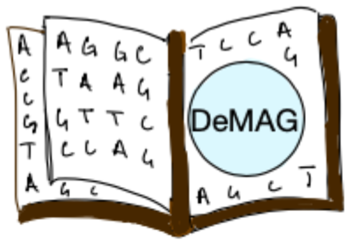

# DeMAG 

We present **DeMAG** (**De**ciphering **M**utations in **A**ctionable **G**enes) a supervised and specialized VEP (Variant Effect Predictor) to interpret any missense mutations in 59 actionable genes (ACMG SF v2.0 genes).

This repository will contain the main scripts (all in R language) and data resources:
- scripts, the directory will contain R scripts to reproduce the analysis (e.g., feature selection, model training and testing),
- data, the directory will contain the training set and the validation sets used to benchmark DeMAG.

[DeMAG web server](https://demag.org) allows scientistist, clinicians or anyone curios to:
- access and download predictions for all ~1.3 million missense mutations for the ACMG SF v2.0 genes (ACMG59 genes),
- investigate the features of the model for any mutation to better understand DeMAG's pathogenicity score,
- download the high-quality training set to fully reproduce our results,
- download the validation sets we used to benchmark DeMAG against popular VEPs (REVEL, EVE, ...).

DeMAG is a joint collaboration between the Max Planck Insitute of Molecular Cell Biology and Genetics (MPI-CBG) and Harvard Medical School (HMS). You can read our paper on bioRxiv:
> ### DeMAG predicts the effect of variants in clinically actionable genes by integrating structural and evolutionary epistatic features
> Federica Luppino1,2, Ivan A. Adzhubei4,5, Christopher A. Cassa4, Agnes Toth-Petroczy*1,2,3
>
>  1. Max Planck Institute of Molecular Cell Biology and Genetics, Dresden 01307, Germany.
> 2. Center for Systems Biology, Dresden 01307, Germany.
> 3. Cluster of Excellence Physics of Life, TU Dresden, 01062 Dresden, Germany.
> 4. Brigham and Womenʼs Hospital Division of Genetics, Harvard Medical School, Boston, MA, 02115 USA.
> 5. Department of Biomedical Informatics, Harvard Medical School, Boston, MA 02115.
